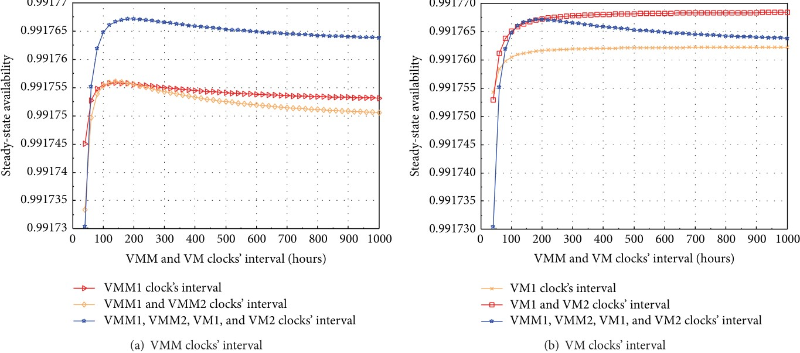
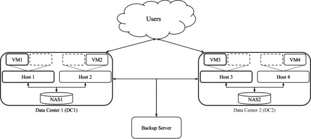

# -! Research on Virtualized Servers Systems (VSS) -!

### Abstract

It is important to assess availability of virtualized systems in IT business infrastructures. Previous work on availability modeling and analysis of the virtualized systems used a simplified configuration and assumption in which only one virtual machine (VM) runs on a virtual machine monitor (VMM) hosted on a physical server. In this research, we show a comprehensive availability model using stochastic reward nets (SRN). The model takes into account (i) the detailed failures and recovery behaviors of multiple VMs, (ii) various other failure modes and corresponding recovery behaviors (e.g., hardware faults, failure and recovery due to Mandelbugs and aging-related bugs), and (iii) dependency between different subcomponents (e.g., between physical host failure and VMM, etc.) in a virtualized servers system. We also show numerical analysis on steady state availability, downtime in hours per year, transaction loss, and sensitivity analysis. This model provides a new finding on how to increase system availability by combining both software rejuvenation at VM and VMM in a wise manner.

### A virtualized servers system (VSS)

The architecture of a typical virtualized servers system (VSS) with multiple VMs is depicted in Figure 1. The VSS consists of two physical servers (also called hosts, host1 and host2). Both hosts have an identical configuration. Each host has a VMM (which is also known as hypervisor) and each host runs two VMs on its VMM. Each VM subsystem is composed of an operating system (OS) and multiple identical applications (Apps) as wanted. In this research, we disregard the involvement of OS, Apps, and workload. The hosts share a storage area network (SAN) on which the VM images or VMM source code files are stored. We will be using this system to study availability of a virtualized system. The model can be further extended in the future, but our focus is to take into account the detailed behaviors of a virtualized system, in contrast to incorporating a large scale cloud system.

**Figure 1: Architecture of a Virtualized Servers System (VSS)**

**Figure 2: Stochastic Reward Net Models of a VSS**

**Figure 3: SSA sensitivity analysis of VM subsystem with respect to VMM and VM clocks’ interval.**

### Remarks

We have modeled and analyzed a virtualized servers system with multiple VMs via SRN. We encapsulated four VMs running on two VMMs into two hosts. We also incorporated diverse failure modes and corresponding recovery behaviors regarding hardware and software aspects including host failure, SAN failure, aging-related failure, and Mandelbugs related failure in SRN models. A variety of dependencies were taken into account in modeling as follows: (i) dependencies between a host and its hosted VMM, in turn between the VMM and its hosted VMs; (ii) interconnection dependency between SAN and VM subsystems; and (iii) marking dependency between VMs in a host. The SSA analysis showed that a frequent rejuvenation policy on VM may lower the SSA of the virtualized systems whereas that on VMM may enhance the system SSA. Based on the sensitivity analysis with respect to SSA, we showed that adopting a particular combination of rejuvenation on all VMM and VM subsystems in both hosts with the value of common interval in a specific range may help to increase system availability of the virtualized system.

# Research on Disaster Tolerant Data Centers (DTDC)

### Highlights

- We present a comprehensive availability modeling and analysis of a data center system for disaster tolerance.
- We assess availability characteristics of a data center regarding disaster occurrence, unexpected failure of network connection and complicated dependencies.
- The study reflects significance of the incorporation of disaster and fault tolerant techniques into geographically distributed data centers for high availability of cloud based businesses.
- The study provides a selection basis of designing for disasters considering the trade-off between system availability and downtime cost with infrastructure construction cost.

### Introduction

Availability assessment of a data center with disaster tolerance (DT) is demanding for cloud computing based businesses. Previous work attempted to model and analyze the computing systems without a good consideration on disaster occurrence, unexpected failure of network connection and proper dependencies between subsystems in a data center. This research presents a comprehensive availability model of a data center for DT using stochastic reward nets (SRN). The model incorporates (i) a typical two-level high availability (HA) configuration (i.e., active/active between sites and active/passive within a site), (ii) various fault and disaster tolerant techniques; (iii) dependencies between subsystems (e.g. between a host and virtual machines (VMs), between a network area storage (NAS) and VMs) and dependency between disastrous events and physical subsystems; and (iv) unexpected failures during data transmission between data centers. The constructed SRN model is analyzed on the basis of steady state analysis, downtime cost analysis, and sensitivity analysis with regard to major impacting parameters. The analysis results show the availability improvement of the disaster tolerant data center (DTDC) and featured system responses corresponding to the selected variables. The modeling and analysis of the DTDC in this research provide a selection basis of designing for disasters in consideration of the trade-off between system availability and downtime cost with infrastructure construction cost.

### Architecture

A DTDC system architecture depicted comprises two Data Center (DC)s (namely, DC1 and DC2) geographically distributed at two distant sites. Each DC is composed of the same architecture consisting of two hosts, two VMs and one Network Area Storage (NAS). A host is capable of running a VM and having a number of VM vacancies for the sake of migration of VMs from the remaining host in the same DC or from the other hosts in the remaining DC. The two hosts in a DC connect to the NAS in order to store VMs images and operational data. For clarity, we list down the components of each DC as follows. DC1 consists of host 1, host 2, NAS1, VM1 and VM2 initially. Whereas, DC2 comprises host 3, host 4, NAS2, VM3 and VM4. In the DC1, host 1 runs VM1 and host 2 runs VM2 respectively. Also, host 1 and host 2 connect to NAS1. In the DC2, host 3 and host 4 connect to NAS2 and run VM3 and VM4 respectively. In order to perform FT between the two sites, the two DCs are connected via a dedicated inter-site link which is useful for time critical and high bandwidth connection. 

**Architecture of a Disaster Tolerant Data Center (DTDC)**

For the sake of DT between the two sites, a backup server involves as an intermediary in charge of constant storage of VMs and instant recovery right after disaster occurrence. Thus, both DCs also connect to the backup server via the dedicated inter-site links. The overall system configuration chosen in this architecture is active/active (i.e., both DCs are initialized to operate at the beginning) whereas the configuration of hosts within each DC is active/passive (one host is up and provides services and the other host runs in standby mode). Both DC1 and DC2 are in active mode. In DC1, the active components are host 1 and VM1; and, host 3 and VM3 are initialized in active mode at DC2. Therefore, the system starts with VM1 and VM3 in running state, VM2 and VM4 in standby state.

### Disaster-Tolerant Configuration of DTDCs

Based on the DTDC system architecture, we can form different system configurations depending on the operational states of the DCs and the hosts within a DC. Four system configurations for the DTDC are formed. The configuration (I) and (II) represent that the DC1/DC2 are in active/active mode whereas the configuration (III) and (IV) represent that one DC (DC1) is active and the other DC (DC2) is passive. A DC is active if at least one of its hosts is also active. And a DC is passive if both hosts are also passive in that DC. Hence, the host configuration in a DC can vary in the configurations (I, II, III or IV). 

**Disaster-Tolerant Configuration of DTDCs**

In the configuration (I), both hosts in a DC at both sites are in active/active mode. In each DC of the configuration (II), one host is in active mode but the other host is in passive mode. In the configuration (III), one DC has both hosts in active mode whereas the other DC has both hosts in passive mode. Lastly, in the configuration (IV), only one host in a DC is in active mode, all the other hosts are in passive mode. It is not easy to assess any of the above system configurations without any modeling and analysis. The configurations (I) and (II) with both DCs in active/active mode are expected to obtain higher utilization of system computing resources in comparison with the configurations (III) and (IV). We limit ourselves to sharply focus on modeling and analysis of the system under the configuration (II) in which we can desperately incorporate the HA plus FT and DT respectively within a DC and between DCs in detail.

### Stochastic Reward Net Model of of DTDCs

**SRN system model of a DTDC**
