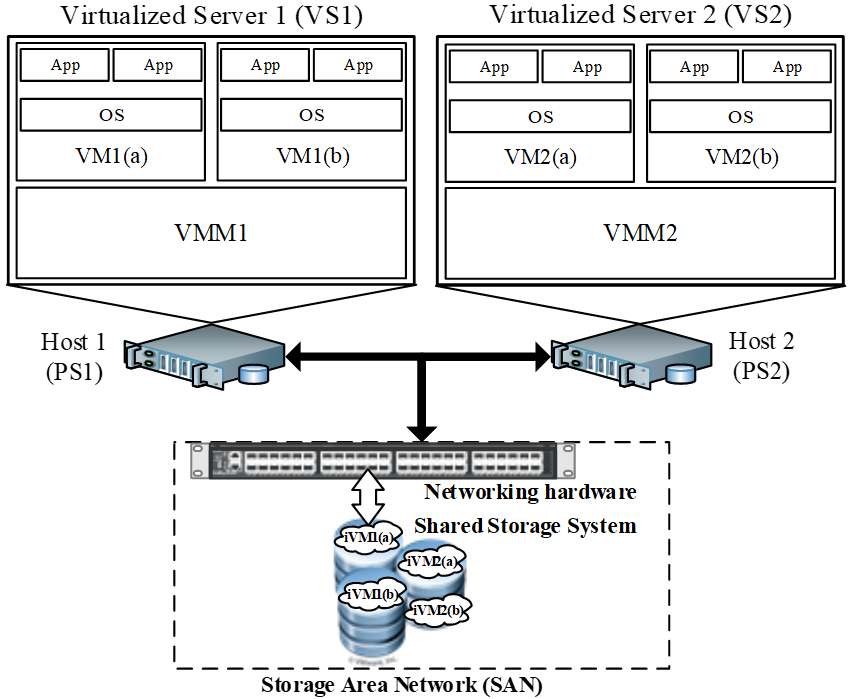

# Research on Virtualized Servers Systems

It is important to assess availability of virtualized systems in IT business infrastructures. Previous work on availability modeling and analysis of the virtualized systems used a simplified configuration and assumption in which only one virtual machine (VM) runs on a virtual machine monitor (VMM) hosted on a physical server. In this research, we show a comprehensive availability model using stochastic reward nets (SRN). The model takes into account (i) the detailed failures and recovery behaviors of multiple VMs, (ii) various other failure modes and corresponding recovery behaviors (e.g., hardware faults, failure and recovery due to Mandelbugs and aging-related bugs), and (iii) dependency between different subcomponents (e.g., between physical host failure and VMM, etc.) in a virtualized servers system. We also show numerical analysis on steady state availability, downtime in hours per year, transaction loss, and sensitivity analysis. This model provides a new finding on how to increase system availability by combining both software rejuvenation at VM and VMM in a wise manner.

The architecture of a typical virtualized servers system (VSS) with multiple VMs is depicted in Figure 1. The VSS consists of two physical servers (also called hosts, host1 and host2). Both hosts have an identical configuration. Each host has a VMM (which is also known as hypervisor) and each host runs two VMs on its VMM. Each VM subsystem is composed of an operating system (OS) and multiple identical applications (Apps) as wanted. In this research, we disregard the involvement of OS, Apps, and workload. The hosts share a storage area network (SAN) on which the VM images or VMM source code files are stored. We will be using this system to study availability of a virtualized system. The model can be further extended in the future, but our focus is to take into account the detailed behaviors of a virtualized system, in contrast to incorporating a large scale cloud system.

**Figure 1: Architecture of a Virtualized Servers System (VSS)**

