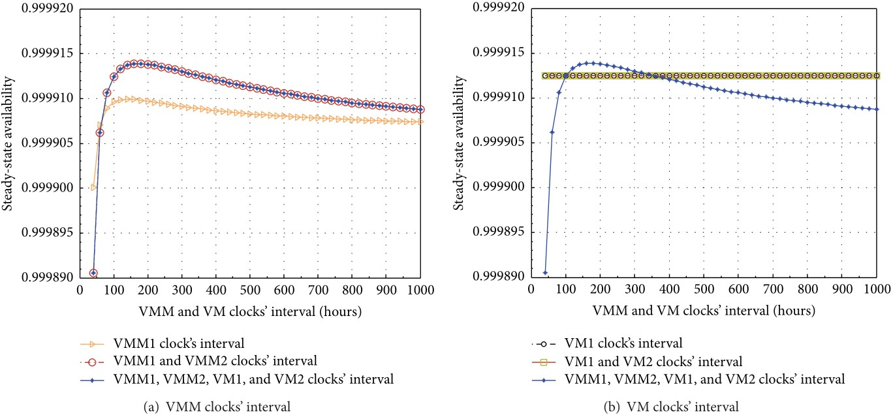
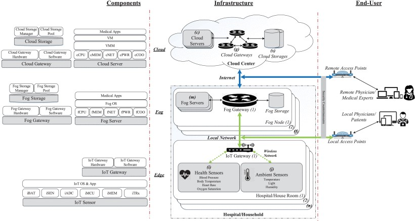
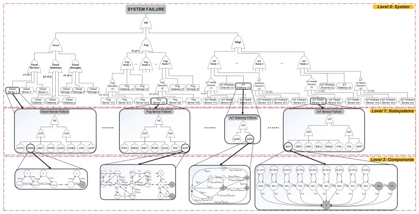
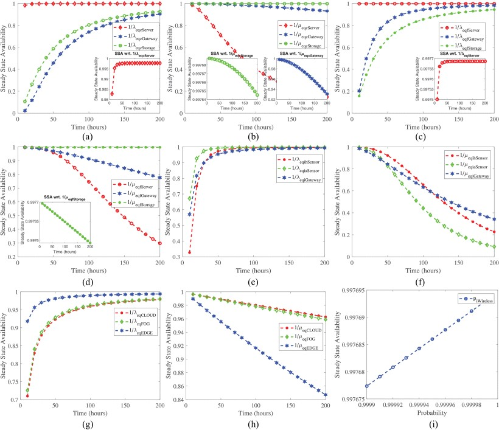
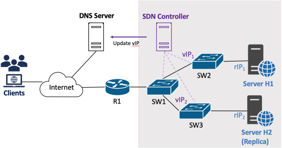
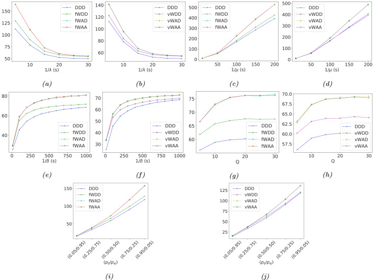

---------------------------------------

#  Research on Dependability of Virtualized Servers Systems (VSS) 

### Abstract

It is important to assess availability of virtualized systems in IT business infrastructures. Previous work on availability modeling and analysis of the virtualized systems used a simplified configuration and assumption in which only one virtual machine (VM) runs on a virtual machine monitor (VMM) hosted on a physical server. In this research, we show a comprehensive availability model using stochastic reward nets (SRN). The model takes into account (i) the detailed failures and recovery behaviors of multiple VMs, (ii) various other failure modes and corresponding recovery behaviors (e.g., hardware faults, failure and recovery due to Mandelbugs and aging-related bugs), and (iii) dependency between different subcomponents (e.g., between physical host failure and VMM, etc.) in a virtualized servers system. We also show numerical analysis on steady state availability, downtime in hours per year, transaction loss, and sensitivity analysis. This model provides a new finding on how to increase system availability by combining both software rejuvenation at VM and VMM in a wise manner.

### A virtualized servers system (VSS)

The architecture of a typical virtualized servers system (VSS) with multiple VMs is depicted in Figure 1. The VSS consists of two physical servers (also called hosts, host1 and host2). Both hosts have an identical configuration. Each host has a VMM (which is also known as hypervisor) and each host runs two VMs on its VMM. Each VM subsystem is composed of an operating system (OS) and multiple identical applications (Apps) as wanted. In this research, we disregard the involvement of OS, Apps, and workload. The hosts share a storage area network (SAN) on which the VM images or VMM source code files are stored. We will be using this system to study availability of a virtualized system. The model can be further extended in the future, but our focus is to take into account the detailed behaviors of a virtualized system, in contrast to incorporating a large scale cloud system.

**Figure 1: Architecture of a Virtualized Servers System (VSS)**

**Figure 2: Stochastic Reward Net Models of a VSS**

**Figure 3: SSA sensitivity analysis of VM subsystem with respect to VMM and VM clocks’ interval.**

### Remarks

We have modeled and analyzed a virtualized servers system with multiple VMs via SRN. We encapsulated four VMs running on two VMMs into two hosts. We also incorporated diverse failure modes and corresponding recovery behaviors regarding hardware and software aspects including host failure, SAN failure, aging-related failure, and Mandelbugs related failure in SRN models. A variety of dependencies were taken into account in modeling as follows: (i) dependencies between a host and its hosted VMM, in turn between the VMM and its hosted VMs; (ii) interconnection dependency between SAN and VM subsystems; and (iii) marking dependency between VMs in a host. The SSA analysis showed that a frequent rejuvenation policy on VM may lower the SSA of the virtualized systems whereas that on VMM may enhance the system SSA. Based on the sensitivity analysis with respect to SSA, we showed that adopting a particular combination of rejuvenation on all VMM and VM subsystems in both hosts with the value of common interval in a specific range may help to increase system availability of the virtualized system.

---------------------------------------

#  Research on Dependability of Disaster Tolerant Data Centers (DTDC) 

### Highlights

- We present a comprehensive availability modeling and analysis of a data center system for disaster tolerance.
- We assess availability characteristics of a data center regarding disaster occurrence, unexpected failure of network connection and complicated dependencies.
- The study reflects significance of the incorporation of disaster and fault tolerant techniques into geographically distributed data centers for high availability of cloud based businesses.
- The study provides a selection basis of designing for disasters considering the trade-off between system availability and downtime cost with infrastructure construction cost.

### Introduction

Availability assessment of a data center with disaster tolerance (DT) is demanding for cloud computing based businesses. Previous work attempted to model and analyze the computing systems without a good consideration on disaster occurrence, unexpected failure of network connection and proper dependencies between subsystems in a data center. This research presents a comprehensive availability model of a data center for DT using stochastic reward nets (SRN). The model incorporates (i) a typical two-level high availability (HA) configuration (i.e., active/active between sites and active/passive within a site), (ii) various fault and disaster tolerant techniques; (iii) dependencies between subsystems (e.g. between a host and virtual machines (VMs), between a network area storage (NAS) and VMs) and dependency between disastrous events and physical subsystems; and (iv) unexpected failures during data transmission between data centers. The constructed SRN model is analyzed on the basis of steady state analysis, downtime cost analysis, and sensitivity analysis with regard to major impacting parameters. The analysis results show the availability improvement of the disaster tolerant data center (DTDC) and featured system responses corresponding to the selected variables. The modeling and analysis of the DTDC in this research provide a selection basis of designing for disasters in consideration of the trade-off between system availability and downtime cost with infrastructure construction cost.

### Architecture

A DTDC system architecture depicted comprises two Data Center (DC)s (namely, DC1 and DC2) geographically distributed at two distant sites. Each DC is composed of the same architecture consisting of two hosts, two VMs and one Network Area Storage (NAS). A host is capable of running a VM and having a number of VM vacancies for the sake of migration of VMs from the remaining host in the same DC or from the other hosts in the remaining DC. The two hosts in a DC connect to the NAS in order to store VMs images and operational data. For clarity, we list down the components of each DC as follows. DC1 consists of host 1, host 2, NAS1, VM1 and VM2 initially. Whereas, DC2 comprises host 3, host 4, NAS2, VM3 and VM4. In the DC1, host 1 runs VM1 and host 2 runs VM2 respectively. Also, host 1 and host 2 connect to NAS1. In the DC2, host 3 and host 4 connect to NAS2 and run VM3 and VM4 respectively. In order to perform FT between the two sites, the two DCs are connected via a dedicated inter-site link which is useful for time critical and high bandwidth connection.

**Architecture of a Disaster Tolerant Data Center (DTDC)**

For the sake of DT between the two sites, a backup server involves as an intermediary in charge of constant storage of VMs and instant recovery right after disaster occurrence. Thus, both DCs also connect to the backup server via the dedicated inter-site links. The overall system configuration chosen in this architecture is active/active (i.e., both DCs are initialized to operate at the beginning) whereas the configuration of hosts within each DC is active/passive (one host is up and provides services and the other host runs in standby mode). Both DC1 and DC2 are in active mode. In DC1, the active components are host 1 and VM1; and, host 3 and VM3 are initialized in active mode at DC2. Therefore, the system starts with VM1 and VM3 in running state, VM2 and VM4 in standby state.

### Disaster-Tolerant Configuration of DTDCs

Based on the DTDC system architecture, we can form different system configurations depending on the operational states of the DCs and the hosts within a DC. Four system configurations for the DTDC are formed. The configuration (I) and (II) represent that the DC1/DC2 are in active/active mode whereas the configuration (III) and (IV) represent that one DC (DC1) is active and the other DC (DC2) is passive. A DC is active if at least one of its hosts is also active. And a DC is passive if both hosts are also passive in that DC. Hence, the host configuration in a DC can vary in the configurations (I, II, III or IV).

**Disaster-Tolerant Configuration of DTDCs**

In the configuration (I), both hosts in a DC at both sites are in active/active mode. In each DC of the configuration (II), one host is in active mode but the other host is in passive mode. In the configuration (III), one DC has both hosts in active mode whereas the other DC has both hosts in passive mode. Lastly, in the configuration (IV), only one host in a DC is in active mode, all the other hosts are in passive mode. It is not easy to assess any of the above system configurations without any modeling and analysis. The configurations (I) and (II) with both DCs in active/active mode are expected to obtain higher utilization of system computing resources in comparison with the configurations (III) and (IV). We limit ourselves to sharply focus on modeling and analysis of the system under the configuration (II) in which we can desperately incorporate the HA plus FT and DT respectively within a DC and between DCs in detail.

### Stochastic Reward Net Model of of DTDCs

**SRN system model of a DTDC**

### Remarks

This research has presented a comprehensive modeling and analysis of a DTDC. Our work studied a typical HA configuration of the DTDC consisting of two geographically distributed data centers under the active/active pair. In each data center, two hosts in active/passive pair were installed with a VM running on each one. We attempted to model the system in detail using SRN with the incorporation of fault and disaster tolerant techniques. The dependencies between components in the system architecture were also captured in a complete manner including (a) between hosts and VMs, (b) between NAS and VMs, and (c) between disastrous events and hardware subsystems (hosts and NAS). Furthermore, we took into consideration the unexpected failure events of data transmission along the network connection between the geographically distributed parts (i) between two distant data centers and (ii) between the backup server and the data centers. To study the systems characteristics and responses, the steady state analysis, downtime cost analysis and sensitivity analysis were conducted thoroughly. The steady state analyses were carried out with eight typical cases in consideration of three parameters including two imperfect coverage factors and meantime to disaster occurrence. Whereas in the sensitivity analysis, five major parameters which feature for disaster tolerant properties of the system and expose a certain influence on the system responses were selected as analysis variables. The analysis pointed out that (i) a data center can achieve a much higher availability with rather than without DT and the data centers located in an area with less disastrous events also gain higher availability; (ii) unexpected failures along the data transmission process bear a certain loss on the system availability; (iii) network speed between geographically distributed parts correlates with VM image size on impacting the system availability. Therefore, the design of the DTDC to meet industrial demands may need to consider the above parameters in an appropriate trade-off between system availability, efficiency and downtime cost, with infrastructure construction cost under the mutual agreement between customers and system owner specified in SLA documents.

---------------------------------------

#  Research on Dependability of Internet of Medical Things (IoMT) 

### Abstract

Rising aggressive virus pandemics urge to conduct studies on dependability and security of modern computing systems to secure autonomous and continuous operations of healthcare systems. In that regard, we propose to quantify dependability and security measures of an Internet-of-Medical Things (IoMT) infrastructure relied on an integrated physical architecture of cloud/fog/edge (CFE) computing paradigms in this article. We propose a reliability/availability quantification methodology for the IoMT infrastructure using a hierarchical model of three levels: 1) fault tree (FT) of overall IoMT infrastructure consisting of CFE member systems; 2) FT of subsystems within CFE member systems; and 3) continuous-time Markov chain (CTMC) models of components/devices in the subsystems. We incorporate a number of failure modes for the underlying subsystems, including Mandel-bug related failures and non-Mandel bugs related failure, as well as failures due to cyber-security attacks on software subsystems. Five case-studies of configuration alternation and four operational scenarios of the IoMT infrastructure are considered to comprehend the dependability characteristics of the IoMT physical infrastructure. The metrics of interest include reliability over time, steady state availability (SSA), sensitivity of SSA wrt. selected mean time to failure—equivalent (MTTFeq) and mean time to recovery—equivalent (MTTReq), and sensitivity of SSA wrt. frequencies of cyber-security attacks on software subsystems. The analysis results help comprehend operational behaviors and properties of a typical IoMT infrastructure. The findings of this study can improve the design and implementation of real-world IoMT infrastructures consisting of cloud, fog, and edge computing paradigms.

### Hierarchical Modeling and Analysis Framework for IoMT Infrastructures

To quantify reliability, availability and security measures of a multi-level complex IoMT infrastructure, it requires a suitable hierarchical modeling and analysis framework. A number of different sub-models is organized in a hierarchical manner to form a multi-level system model in order to model heterogeneous features and integration of IoMT infrastructures while also to capture operational behaviors of bottom-most subsystems/components. The proposed hierarchical modeling and analysis framework utilises (i) the capability in generating combinatorial models in accordance with considered system architecture with simplicity and rapidity and (ii) the capability in elaborating underlying operational behaviors (states and transitions) into state-based models all together forming an overall hierarchical model of the IoMT infrastructure. In this study, we propose a hierarchical modeling and analysis framework, specifically for reliability, availability and security assessment of multi-level IoMT infrastructures. The proposed hierarchical system model encompasses three-fold heterogeneous models including (i) FT system model ($\Psi$) in the top level to capture overall system architecture of the IoMT infrastructure consisting of different member systems, (ii) FT subsystem models ($\Delta$) in the middle level to model subsystems' architectures in each member system and (iii) state-based models ($\Phi$) in the bottom-most level to capture operational behaviors featured by failure modes and recovery strategies of every components in each subsystem. Without loss of generality, the developed hierarchical model of an IoMT infrastructure is represented as a graph of $\Psi$, $\Delta$, $\Phi$.

***A hierarchical modeling framework***

### An Internet of Medical Things (IoMT)

A typical system design of an IoMT infrastructure for healthcare monitoring purposes . The physical architecture design of the IoMT infrastructure is aimed to provide sufficient information about the overall organization of member systems, subsystems and underlying components/parts. In this work, an architecture is proposed to represent the behaviors of an IoMT infrastructure for e-health monitoring purposes that relies on IoMT sensors, fog devices in the local areas and cloud services at a remote distance to process and store medical data of patients at home or in hospital, and to provide real-time data analysis and recommendation functionalities between patients and (local/remote) physicians/medical experts. The IoMT infrastructure's architecture for healthcare monitoring functionalities is presented in the perspectives of (i) end-users who are physician and/or medical experts at a remote distance or physicians and/or patients in local areas interacting with the IoMT based e-health infrastructure via user-based customized interface applications without knowing its underlying operations, (ii) system managers and/or operational practitioners who often pay more attention on the efficient design trade-offs relating to the overall infrastructure, and (iii) physical system developers who specifically consider the details of the underlying layers of the IoMT infrastructure from the bottom-most level of physical components/devices to the top level of the architecture. On the end-user side, remote physicians or medical experts can access medical data of patients via a cloud-based web portal/application through a remote access point, while local medical supervisors and caregivers can retrieve instantly medical data of patients via a fog-based web portal/application through a local access point. It is assumed that security countermeasures are implemented to diminish cyber-attacks from anonymous and unauthorized accesses to the underlying infrastructure through the access points. Due to stringent requirements for the medical physicians/supervisors to constantly access trusted medical data at whatever time and from any place, the architecture design of the e-health IoMT infrastructure needs to provide the highest values of reliability/availability and security measures as possible to data processing tasks and protection mechanisms. Thus, in the perspective of system managers and operational practitioners, the e-health IoMT infrastructure in consideration is composed of three-fold CFE member systems with a specific configuration as follows.

- **Cloud** member system mainly consists of a specific *c* number of cloud servers (*cServer*) interconnected to each other and to a cloud storage system of *s* physical cloud storages (*cStorage*) through a network of physical cloud-oriented gateways (*cGateway*). The physical cloud infrastructure is often located remotely in distant and centralized cloud centers equipped with a persistent internet connection to local member systems. Cloud services hosted on cloud virtualized servers include advanced data processing capabilities and superior technologies. The cloud services provide cloud solutions for data warehouse, data analytics, and data broadcasting functionalities.

- **Fog** member system is composed of a specific *f* number of fog nodes (*fNode*) which are often geographically distributed in the local area such as in an individual smart building of a hospital or a personal house. A fog node in turn consists of a number *m* of fog servers (*fServer*) which are able to perform computing/data transactions with other fog nodes and/or with other cloud/edge member systems via a fog gateway (*fGateway*). Each fog node is also equipped with a fog storage (*fStorage*) acting as a fog repository (local database).

- **Edge** member system mainly encompasses a number *n* of IoMT nodes (*iNode*). Each IoMT node in turn, contains IoMT ubiquitous sensors including non-body-attached or wearable sensors (*ihSensor*) and ambient sensors (*iaSensor*) to constantly collect real-time biomedical and surrounding environment data of patients. Those biomedical and context data represents a source of big data for statistical and epidemiological medical studies. The huge amount of collected data is transmitted to an IoMT gateway (*iGateway*) for pre-processing and further data transactions from/to fog and cloud member systems. Supposed that those IoMT sensors transmit and receive signals from/to the IoMT gateway via a single wireless connection protocol (which is called *iWireless*).

Physical system developers' perspective focuses on detailed composition of bottom-most components and devices throughout the member systems to be broken down as follows.

- **Cloud server** (*cServer*) is composed of physical hardware (*cHW*) and software (*cSW*) components. The physical hardwares of a cloud server mainly include central processing unit (*cCPU*), memory banks (*cMEM*), network interface cards (*cNET*), power supply unit (*cPWR*) and cooling unit (*cCOO*). On top of the cloud server's hardware *cHW*, a cloud VMM (*cVMM*) is built-in to host a cloud *VM* subsystem consisting of a number *ncVM* of cloud *VM*s (*cVM*). Without loss of generality, it is supposed that the cloud *VM* subsystem runs an overall number *ncAPP* of cloud-based medical applications. Cloud gateway (*cGateway*) is simply composed of physical hardware (*cgHW*) and software (*cgSW*) components dedicated to cloud services. Cloud storage (*cStorage*) consists of a system of *ncSD* cloud storage disks (*cSD*) and a cloud storage manager (*cSM*).

- **Fog server** (*fServer*) comprises physical hardware component (*fHW*) (which are similar to those of cloud server) and fog software components (*fSW*). The fog server's hardware also consists of central processing unit (*fCPU*), memory banks (*fMEM*), network interface cards (*fNET*), power supply unit (*fPWR*) and cooling unit (*fCOO*). Nevertheless, different from the cloud server's software, the software part of the fog server include an underlying fog OS (*fOS*) and its upper fog-based medical applications (*fAPP*). Fog gateway (*fGateway*) and fog storage (*fStorage*) have a similar architecture design compared to cloud gateway *cGateway* and cloud storage *cStorage*. Fog gateway *fGateway* comprises physical hardware (*fgHW*) and software (*fgSW*), while fog storage *fStorage* is composed of fog storage disks (*fSD*) with a number *nfSD* disks and fog storage manager (*fSM*).

- **IoMT sensors** (*ihSensor* & *iaSensor*) are usually an embedded board with an identical architecture containing a battery pack (*iBAT*), a sensing part (*iSEN*), an analog-to-digital conversion unit (*iADC*), a micro-controller unit (*iMCU*), a tiny memory part (*iMEM*) and a transceiver (*iTRx*). IoMT gateway (*iGateway*) comprises its physical hardware (*igHW*) and software (*igSW*) components.

### Stochastic Models of IoMT

***Stochastic reward net model of IoMT***

***Sensitivity Analysis of System Availability***

### Remarks

Reliability, availability, and security have been always important dependability measures to quantify the level of QoS of IoMT infrastructures for healthcare monitoring in the circumstances of rising health-related pandemics. In this article, we presented a theoretical approach for dependability quantification of IoMT infrastructures using a threefold hierarchical modeling and analysis framework. A comprehensive hierarchical model was also developed in accordance with a three-level architecture of a typical IoMT infrastructure for healthcare monitoring featured with a continuum of three computing paradigms of cloud, fog, and edge. The overall hierarchical infrastructure model consists of: 1) FT models in the top and middle levels to capture corresponding structural architectures of the overall infrastructure, its member systems, and subsystems and 2) Markov models in the bottom level to incorporate various operational behaviors (failure and recovery) of both hardware and software components within every subsystem. Specific case studies and operational scenarios with corresponding hierarchical models were also presented to comprehend the dependability properties of the IoMT infrastructure under various configurations as well as in different circumstances.

Numerous analyses were performed in detail for the developed models of the default architecture of the considered IoMT infrastructure and the alternated architectures of case studies and scenarios, including: 1) reliability analyses; 2) SSA analyses; 3) availability sensitivity analyses wrt. impacting factors; and 4) security analyses considering the impact of attack intensities on system availability. The proposed hierarchical modeling and analysis framework along with developed hierarchical models and comprehensive analyses of a typical IoMT infrastructure presented in this work are expected: 1) to provide a novel approach toward dependability evaluation of sophisticated and multilevel architectures of IoMT infrastructures in practice and also 2) to guide system developers and practitioners either design an optimized architecture of IoMT infrastructures to obtain a proper level of QoS or to operate a practical IoMT infrastructure to provide the best operational services as possible to clients. Further works, including: 1) performance analysis under availability constraints based on hierarchical stochastic models (performability analysis) and 2) development of automated evaluation tools for different structural architectures of IoMT infrastructures can be fruitful extensions of this study to provide a multi-perspective comprehension on the CFE continuum-based IoMT infrastructure.

---------------------------------------

#  Research on Dependability and Security of Software-Defined Network (SDN) 

### Abstract

It is essential to comprehend different aspects of performability of a system adopting Moving Target Defence (MTD) techniques. A number of previous works showed significant progress on security effectiveness evaluation for MTD mechanisms. While, a lesser amount of studies considered the impact of running MTD mechanisms on system dependability metrics, exposing a critical missing on the comprehension of pros and cons of MTD mechanisms in terms of security and dependability. In this paper, we present comprehensive modelling and analysis of time-based switch-over MTD strategies complying with IP shuffling techniques deployed in a Software Defined Network (SDN) using stochastic reward net (SRN). To investigate the impact of MTD strategies along with system availability on service performance metrics, we propose performability SRN models for various switch-over MTD strategies. The modelled behaviours of the switch-over MTD strategies are based on the integration of service management policies (drop/accept) with time-based switch-over policies (zero-time, fixed-time, and variable-time waiting policies) Critical performability metrics are comprehensively evaluated, including (i) system availability, downtime minutes, and Capacity-oriented Availability (COA) of a service, (ii) service throughput, (iii) response time of a job, (iv) average utilization of a server, (v) number of lost jobs, and (vi) operational cost (power consumption and business profit loss). The analysis results reveal sophisticated operational system behaviours and the impact of MTD strategies on system performability metrics. This study can help design and plan the development and adoption of MTD strategies in practice regarding the trade-offs between security and performability assurance.

### A software-defined network (SDN)

SDN is a programmable network system that can dynamically change network configuration according to security policies. A time-based IP shuffling reassigns virtual IP (*vIP*) address into real IP (*rIP*) address of end-servers that can be updated into DNS. Legitimate clients can obtain the valid *vIP* from DNS and send requests to enterprise servers. Dynamic IP mutation provides security benefits (e.g., increasing complexity), however, it accordingly enlarges performance overhead due to the unintended disconnection between legitimate clients and enterprise servers.

***System architecture of a Software Defined Network (SDN)***

In order to reduce performance degradation in network systems due to MTD, we proposed a switch-over strategy offering the additional server (aka server *H2*) that has the same implementation and functions as server *H1*. A server *H1* and a replica (*H2*) deal with newly incoming requests from clients, in turn, every MTD intervals while its counterpart retains the current connections with legitimate clients and keeps processing remaining jobs in transit or in queues of servers according to predefined policies or rules. SDN controller manages *vIP* tables and adds flow entries to change *vIP* into *rIP* in the connected switches (SW2 and SW2) respectively. The key role of an SDN controller in our proposed system is to update flow tables of the connected switches according to the proposed MTD policies and renew new virtual IP addresses to a DNS server. As a control plane of an SDN system, an SDN controller is required to keep inserting or deleting flow rules in the table of each switch and update the database of a DNS server every MTD interval. It results in the increase of workload in an SDN controller of our proposed system compared to conventional systems. It leads that end-servers can communicate with the legitimate client by only using their own *rIP*. However, these clients do not realize when the MTD technique is applied until they re-resolve the IP address from DNS server again. TTL, one of DNS attributes can be used of course however, the disconnection between end-servers and clients is not resolved. Therefore, we propose a switch-over strategy in order to minimize connection loss over the network adapting MTD and evaluate in terms of performability in a quantitative manner.

### Stochastic models and results of MTD Mechanisms

***Stochastic Model of MTD Mechanisms in SDN***

***Performance Analysis (System Response Time)***

***Performance Analysis (Dropped Jobs)***

### Remarks

 In this paper, we presented comprehensive performability modelling and analysis of an SDN system adopting switch-over MTD strategies. The chosen techniques for security efficiency in the execution of MTD processes are IP shuffling and server redundancy along with switch-over mechanisms for performability assurance. The triggering MTD mechanism is the time-based approach. While, various service management policies are proposed in the execution and progressing of MTD processes to maintain an expected level of performability measures, which form seven switch-over MTD strategies including (i) DDD strategy with dropping and zero-time waiting policies (*D*) for jobs at all places, (ii) (fWDD, fWAD, fWAA) and (vWDD, vWAD, vWAA) strategies with fixed-time and variable-time waiting policies (*fW*and *vW*) for ongoing jobs in servers, respectively and corresponding accepting (*A*) and dropping (*D*) policies for jobs in servers' service queue and jobs in transit. In accordance with the considered MTD strategies in this work, we proposed different comprehensive performability SRN models and performed detailed simulations and analyses for the evaluation of performability metrics. Specifically, availability and performance metrics of the system were analysed under default parameters while sensitivity analyses of performability metrics were conducted with regard to various significant parameters including job arrival rate, service rate, MTD interval, service queue size of servers, a ratio of long/short job types. Performability metrics of interest include (i) availability and downtime minutes in a day of a physical system, and COA of services for availability analyses, and (ii) service throughput, server utilization, service response time, number of lost jobs per hour and operational cost for performance analyses. The analysis results revealed a comprehension of the impact and thus trade-offs for the implementation of MTD strategies on the performability metrics and operational behaviours of the system, particularly (i) while complete dropping policy for jobs at all places can secure security efficiency of MTD mechanisms, the policy apparently incurs negative impacts on system performance, (ii) waiting policy for the completion of processing jobs in servers in the execution of MTD strategies can help reduce the impact of dropping policy, and (iii) accepting policy for jobs in servers' service queue and jobs in transit in the network even help diminish the negative impact of the dropping policy and the execution of MTD processes on the system performance. The findings of this study can help develop a comprehensive master plan for the adoption of MTD strategies in practical networked systems for security and performability assurance.
